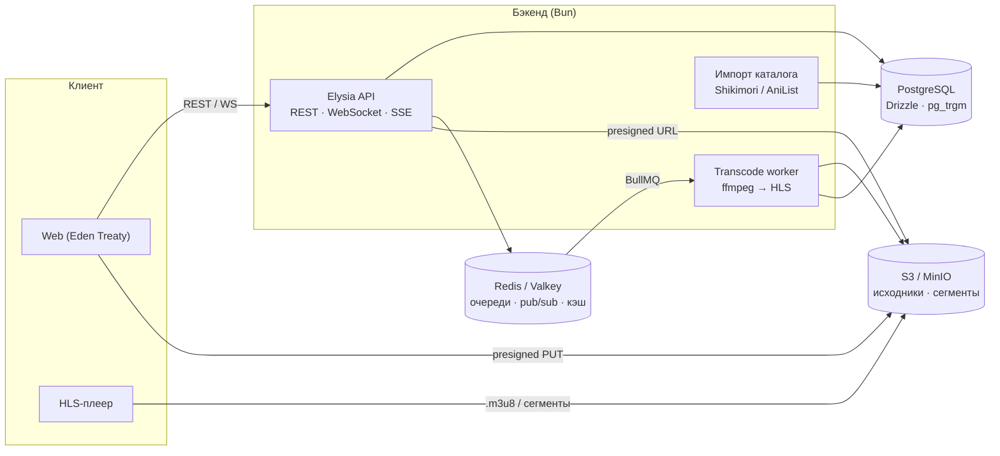

# Yatoro — план развития

> Бэкенд аниме-кинотеки на Bun + Elysia: каталог с умным поиском, личные списки и прогресс
> просмотра, адаптивный стриминг (HLS) и совместный просмотр в реальном времени.

Документ живой: статусы задач обновляются по мере работы.
Легенда: ⬜ не начато · 🟨 в работе · ✅ готово

---

## 1. Цель

Проект для портфолио. Ревьюер тратит на репозиторий 5–10 минут, поэтому за это время он должен увидеть:

1. **README** — что это, живое демо, гифка, схема архитектуры, запуск одной командой.
2. **Зелёный CI** — линтер, типы, тесты.
3. **`/docs`** — интерактивная OpenAPI-документация.
4. **Нетривиальную инженерию** — очередь задач + ffmpeg + S3, WebSocket + Redis pub/sub, полнотекстовый поиск.
5. **Раздел «Решения и компромиссы»** (ADR) — почему сделано именно так. Это то, о чём спрашивают на собеседовании.

Десять CRUD-эндпоинтов не выделяют проект. Выделяют одна-две глубоко сделанные фичи и аккуратная упаковка.

---

## 2. Аудит текущего состояния (на коммите `d1235b4`)

Проверено двумя способами: чтением кода и минимальным воспроизведением на Elysia 1.4.19 (версия из `bun.lock`).

| # | Серьёзность | Где | Проблема | Как проверено |
|---|---|---|---|---|
| A1 | 🔴 Критично | `src/shared/middlewares/auth.middleware.ts:45` | **Проверка ролей не работает.** `isRole` написан старым синтаксисом `macro(fn)`. В Elysia 1.4 `macro()` разворачивает аргумент как объект (`{ ...fn }`), поэтому макрос не регистрируется, а опция `isRole: "ADMIN"` молча игнорируется. Любой зарегистрированный пользователь может создавать аниме и эпизоды. | Воспроизведение: `USER` → `POST /api/anime` → **201** |
| A2 | 🔴 Критично | `drizzle.config.ts`, `drizzle/` | **Миграции не соответствуют схеме.** Конфиг пишет в `src/database/migrations`, а в репозитории лежит старая папка `drizzle/`, где есть только `genres`. На чистой базе не создаются `anime`, `episodes`, `users`. Проект нельзя поднять с нуля. | Код + журнал миграций |
| A3 | 🟠 Высокая | `src/modules/media/media.service.ts` | **Загрузка файлов → stored XSS.** Тип проверяется по `file.type`, а его присылает клиент. Расширение берётся из имени файла. `evil.html` или `evil.svg` с `Content-Type: image/png` сохранится как есть и будет отдан статикой как HTML. Постеры может загружать любой пользователь. | Код |
| A4 | 🟠 Высокая | `src/modules/users/users.service.ts` | **Утечка email.** Публичный `GET /api/users/:id` отдаёт email и роль. id последовательные (`serial`), поэтому все email можно собрать перебором. | Код |
| A5 | 🟠 Высокая | `src/setup.ts:22` | **Обход rate limit.** Ключ лимита берётся из заголовка `x-api-key`, который задаёт клиент. Новое значение заголовка — новый лимит, то есть перебор паролей ничем не ограничен. | Код |
| A6 | 🟠 Высокая | `src/modules/auth/*` | **JWT без срока жизни**, нет refresh-токенов и отзыва. Два разных экземпляра JWT-плагина; `auth.controller` читает `process.env` в обход валидации env. | Код |
| A7 | 🟡 Средняя | `src/setup.ts:60`, контроллеры | **Утечка внутренних ошибок.** `onError` отдаёт клиенту `error.message` любой ошибки. Drizzle 0.45 кладёт в текст ошибки **SQL-запрос и параметры**: регистрация с занятым `username` вернёт SQL и хеш пароля. Контроллеры превращают любую ошибку в 404/400: если упала база, пользователь увидит «Аниме не найдено». | Код + исходники `drizzle-orm` |
| A8 | 🟡 Средняя | `auth.service.ts` | Email регистрозависимый: `User@mail.com` и `user@mail.com` — два разных аккаунта. Уникальность `username` не проверяется до вставки. Время ответа на логин выдаёт, существует ли email. | Код |
| A9 | 🟡 Средняя | `database/schema/*` | Серии не уникальны по паре (аниме, номер), возможны дубли. `status` хранится как свободная строка. Жанры не связаны с аниме. Типы id разные (uuid и serial). `created_at` может быть null, время хранится без таймзоны. | Код |
| A10 | 🟡 Средняя | `anime.repository.ts` | `GET /api/anime` без пагинации отдаёт всю таблицу. Добавление серии загружает аниме со **всеми** сериями только чтобы проверить, что оно существует. | Код |
| A11 | 🟡 Средняя | `media.*`, `setup.ts` | Видео до 100 МБ целиком читается в память процесса, хранится на локальном диске и отдаётся без адаптивного качества. Глобальный лимит 60 запросов в минуту распространяется и на статику: HLS-сегменты в него упрутся. | Код |
| A12 | ⚪ Низкая | `package.json` | `"elysia": "latest"` — версия не зафиксирована. `drizzle-kit` лежит в `dependencies`. `module: src/index.js` указывает на несуществующий файл. Нет скриптов typecheck/test. | Код |
| A13 | ⚪ Низкая | `src/index.ts` | Логи обещают `/docs` и Better Auth, которых нет. `@elysiajs/openapi` установлен, но не подключён. `drizzle-typebox` не используется. | Код |
| A14 | ⚪ Низкая | `.env.example`, `setup.ts` | В `.env.example` нет `JWT_SECRET` и `PORT`, приложение падает на старте. CORS захардкожен. | Код |
| A15 | ⚪ Низкая | — | Нет тестов, CI, Docker; README из шаблона. | — |
| ✔ | Ок | `auth.middleware.ts` | Подозрение, что `derive({ as: "global" })` делает публичные роуты закрытыми, **не подтвердилось**: они открыты, как и задумано. Всё равно переносим авторизацию в идиоматичный macro v2 `resolve`. | Воспроизведение |

**Что уже хорошо:** слои controller → service → repository, типизированный env через zod,
`export type App` (готово для Eden Treaty), хеширование паролей через `Bun.password` (argon2id).

---

## 3. Обновление стека

Версии на 30.09.2026. ✅ — обновлено в фазе 0.

| Пакет | Было | Стало | Комментарий |
|---|---|---|---|
| Bun | — | ✅ **1.4.2** | Зафиксирован в `packageManager` |
| elysia | `latest` (1.4.19) | ✅ **^1.4.30** | Версия зафиксирована. Elysia 2.0 пока `beta.19`, переход — отдельной задачей после стабильного релиза |
| @elysiajs/cors / jwt | 1.4.0 | ✅ **1.4.2** | |
| @elysiajs/openapi | 1.4.11 (не подключён) | ✅ **1.4.16** | Подключён на `/docs` (Scalar) |
| @elysiajs/static | 1.4.7 | ✅ **1.4.10** | После перехода на S3 (фаза 4) — только для dev |
| drizzle-orm | 0.45.1 | ✅ **0.45.3** | Drizzle 1.0 пока `beta.22`, переход после стабильного релиза |
| drizzle-kit | 0.31.8 (в deps) | ✅ **0.31.11** (в devDeps) | `db:push` убран: он обходит миграции и привёл к A2 |
| drizzle-typebox | 0.3.3 (не используется) | ✅ удалён | Схемы ответов описаны явно в `*.model.ts` — это и контракт API, и защита от утечки новых колонок |
| zod | 4.2.0 | ✅ **4.6.5** | Только для env |
| postgres | 3.4.7 | ✅ **3.4.9** | |
| elysia-rate-limit | 4.4.2 | ✅ **4.6.3** | 5.x требует Elysia 2 — обновимся вместе с ней |
| elysia-logger | 0.5.2 | ✅ **pino 10.3** (+ pino-pretty в dev) | elysia-logger перехватывал ошибки своим `onError` и ломал единый формат ответов |
| bun-types | `latest` | ✅ **@types/bun 1.4.2** | Рекомендуемый пакет типов |
| + @types/node | транзитивно 25.x | ✅ **^24** (dev, фаза 1) | С 25.x `bun-types` 1.4.2 скрывает перегрузки `process.on/once` (сигналы не типизируются). 24 — LTS-линия, совместимая с Bun |
| + @electric-sql/pglite-socket | — | ✅ **0.2.11** (dev, фаза 1) | `bun run db:dev`: PGlite (PostgreSQL 18.3) по протоколу Postgres — локальная база без Docker |
| TypeScript | — | ✅ **7.0.2** (нативный компилятор) | Проверка всего проекта ≈ 0,5 с; tsconfig: `moduleResolution: bundler`, `verbatimModuleSyntax`, `noUncheckedIndexedAccess` |
| + @electric-sql/pglite | — | ✅ **0.5.8** (dev) | Настоящий Postgres внутри процесса — тесты без Docker |
| + Biome | — | ✅ **2.5.15** (dev) | Линтер и форматтер одним инструментом |
| + @elysiajs/eden | — | ✅ **1.4.9** (dev) | Типизированные тесты; позже — фронтенд |
| + file-type | — | ✅ **22.1.1** | Определение типа файла по сигнатуре |
| + BullMQ, Redis/Valkey, MinIO, ffmpeg | — | фаза 4 | Видео-пайплайн |
| + @elysiajs/opentelemetry | — | фаза 6 | Трассировка |

---

## 4. Целевая архитектура



Структура кода:

```
src/
  app.ts                  # сборка приложения (без listen — удобно для тестов)
  index.ts                # запуск сервера, graceful shutdown
  config/env.ts
  database/
    index.ts              # драйвер postgres-js (в тестах подменяется на PGlite)
    migrate.ts
    schema/
    migrations/
    seed.ts
  shared/
    errors.ts             # AppError, NotFoundError, ForbiddenError, ...
    plugins/              # auth-guard (macro v2), error-handler, rate-limit, request-logger
    http.ts               # общие схемы, пагинация
  modules/<feature>/
    <feature>.controller.ts
    <feature>.service.ts
    <feature>.repository.ts
    <feature>.model.ts    # схемы запросов/ответов + маппинг строк БД в ответы
  workers/                # фоновые обработчики (фаза 4)
tests/
docs/
  ROADMAP.md
  adr/                    # записи архитектурных решений
```

---

## 5. Фазы

### Фаза 0 — Фундамент и безопасность ✅

Цель: проект поднимается с нуля, известные уязвимости закрыты, есть тесты.

- ✅ Обновить стек (раздел 3), зафиксировать версии, модернизировать `tsconfig`, скрипты `dev/start/typecheck/test/lint/db:*`
- ✅ Env: полный `.env.example`, валидация (`JWT_SECRET` ≥ 32 символов, `CORS_ORIGINS`, `NODE_ENV`, `JWT_TTL`)
- ✅ **A1** Авторизация на macro v2: `{ auth: true }`, `{ role: "ADMIN" }`, иерархия USER < MODERATOR < ADMIN, один экземпляр JWT, `exp` у токена
- ✅ **A7** Ошибки: `AppError` и наследники, единый `onError`, ответ 500 без внутренних деталей (детали — в лог), единый формат ответа
- ✅ **A4 A8** Пользователи: публичный профиль без email, нормализация email, проверка `username`, обработка нарушения уникальности → 409
- ✅ **A3** Медиа: проверка по сигнатуре файла (file-type), расширение по реальному типу, белый список jpeg/png/webp/avif, постеры и видео только для ADMIN, `CSP: sandbox` + `nosniff` на статике
- ✅ **A5** Rate limit по IP (за доверенным прокси — последний адрес `X-Forwarded-For`), 10 запросов в минуту на `/auth/*`, 120 — на остальное
- ✅ **A9 A10** Схема: enum статуса, `unique(anime_id, episode_number)`, `timestamptz not null`, связь аниме ↔ жанры, пагинация
- ✅ **A2** Миграции: одна чистая базовая миграция в `src/database/migrations`, старую `drizzle/` удалить
- ✅ **A13** OpenAPI на `/docs`, JSON-логи pino с `X-Request-Id`
- ✅ Тесты (`bun test` + PGlite, 36 шт.): регистрация и логин, **USER получает 403 на ADMIN-роутах** (регрессия A1), профиль без email, валидация загрузок

**Готово, когда:** `bun run typecheck && bun run lint && bun test` зелёные, а `bun run db:migrate` на пустой базе создаёт всю схему.

> Итог: `bun run check` зелёный. Миграции проверены на PGlite; на настоящем Postgres — в фазе 1 (docker compose + CI).
> API-изменения: `POST /media/upload/image` → `POST /media/images`, `/media/upload/video` → `/media/videos` (папка `shorts` убрана),
> поле серии `episodeNumber` → `number`, ответы успешных запросов — сам ресурс или `{ items, nextCursor }`.

### Фаза 1 — Инфраструктура разработки 🟨

- ✅ Локальная база без Docker: `bun run db:dev` — PGlite по протоколу Postgres (`@electric-sql/pglite-socket`), данные в `./.pglite`
- ✅ Dockerfile (multi-stage, `oven/bun:1.4.2-alpine`, только prod-зависимости, non-root, HEALTHCHECK), `.dockerignore`
- ✅ `docker-compose.yml`: api + PostgreSQL 18. Redis и MinIO добавим в фазе 4, когда они реально понадобятся
- ✅ `GET /health` (проверка базы с таймаутом, 503 при недоступности), graceful shutdown (SIGINT/SIGTERM), `DATABASE_POOL_MAX`
- ✅ Seed: админ из `SEED_ADMIN_*`, 9 жанров, 7 тайтлов с сериями; идемпотентный
- ✅ GitHub Actions: lint/types/tests · миграции + двойной seed + смоук-тест на настоящем PostgreSQL 18 · сборка Docker-образа
- ✅ README: быстрый старт без Docker, CI-бейдж, скрипты, API
- ✅ Защита `main` (ruleset: только PR, три обязательные проверки CI), Dependabot (bun, Actions, Docker; cooldown,
  группы, исключения для известных несовместимостей), `CLAUDE.md` с договорённостями проекта
- ⬜ Первый зелёный прогон CI на GitHub (после push)
- ⬜ Локальный запуск `docker compose up` — когда будет Docker

> Локально Docker пока нет, поэтому Dockerfile и compose проверяются в CI (job `docker`),
> а миграции на настоящем PostgreSQL — в job `postgres` (там же проверяется graceful shutdown по SIGTERM).
> Локально проверено: `db:dev` → `db:migrate` → двойной `db:seed` → сервер → `/health`, каталог, вход админа —
> всё через драйвер `postgres-js` по сети, PGlite = PostgreSQL 18.3 (та же мажорная версия, что в CI).

### Фаза 2 — Каталог 🟨

- ✅ Модель аниме: slug, названия (ru/en/ja/romaji) и синонимы, тип, статус, сезон и год, серии, длительность,
  возрастной рейтинг, оценка, место в популярности, внешние id (Shikimori, MAL); жанры с типом (жанр/тема/демография) и студии
- ✅ Импорт из Shikimori GraphQL (`bun run catalog:import`): 1000 тайтлов за 14 с; идемпотентный upsert по `shikimori_id`,
  ≤ 85 запросов/мин, повторы на 429/5xx с `Retry-After`; 18+, трейлеры и реклама не импортируются; сезон — из источника
- ✅ Демо-тайтлы seed несут реальные `shikimori_id` — импорт обновляет их, а не дублирует
- ✅ Гибридный поиск: полнотекстовый (стемминг ru/en, веса) + триграммы (опечатки, словоформы), оба через GIN —
  разбор и замеры в [ADR 0001](adr/0001-hybrid-catalog-search.md)
- ✅ Фильтры (жанры с AND, тип, статус, сезон, годы, оценка), сортировки (релевантность, популярность, оценка, новизна,
  название), keyset-пагинация с непрозрачным курсором и индексами под каждую сортировку
- ✅ `GET /api/anime/by-slug/:slug`, студии в карточке, жанры в выдаче каталога одним подзапросом
- ✅ `bun run bench:catalog` — бенчмарк каталога через весь HTTP-путь
- ⏭ Регулярное обновление онгоингов: пока `catalog:import --status ongoing`, по расписанию — repeatable job BullMQ в фазе 4
- ⏭ AniList как второй источник — по необходимости (клиент и маппер изолированы, источник подключается рядом)
- ⬜ Админка: update/delete для аниме и эпизодов, аудит-лог действий — следующий шаг

**Готово, когда:** в каталоге 1000+ реальных тайтлов, p95 поиска < 50 мс, поиск покрыт тестами.

> Итог: 1000 реальных тайтлов; p95 поиска 28–32 мс на 1 000 и 11–50 мс на 20 000 строк (PGlite, WASM);
> 77 тестов, включая поиск с опечаткой и полный проход курсором по каждой сортировке.
>
> Найдено по ходу:
> - `t.UnionEnum` в Elysia всегда ставит `default` = первое значение: пропущенный `season` молча превращался в WINTER,
>   а `ageRating` в `G`. Входные enum-ы теперь через `StringEnum` без неявного default.
> - Drizzle рендерит `${anime.id}` в коррелированном подзапросе как голый `"id"`, и он привязывался к `g.id` жанров:
>   у всех тайтлов в выдаче был один и тот же жанр. Поймано тестом, колонка квалифицирована явно.
> - Стеммер Snowball: «титаны» → `тита`, «титанов» → `титан` — одного полнотекстового поиска недостаточно.

### Фаза 3 — Пользовательские фичи ⬜

- Списки: Смотрю / Запланировано / Просмотрено / Отложено / Брошено; оценки 1–10
- Прогресс просмотра (серия + позиция) → «Продолжить просмотр»; серия отмечается просмотренной после 90%
- Refresh-токены: ротация, обнаружение повторного использования, httpOnly-cookie, выход со всех устройств
- Профиль: аватар, статистика (часы просмотра, любимые жанры)
- Отзывы и комментарии, жалобы, модерация (роль MODERATOR)

### Фаза 4 — Видео-пайплайн (HLS) ⬜ — *главная фича*

- Загрузка сразу в S3/MinIO по presigned URL (multipart): API не держит файл в памяти.
  Сейчас Elysia разбирает тело запроса **до** проверки роли, поэтому даже неавторизованный запрос
  на 100 МБ будет прочитан целиком — presigned-загрузка убирает это полностью
- BullMQ → воркер ffmpeg: HLS 360p/720p/1080p, master-плейлист, кадр-превью, спрайт + WebVTT для превью на таймлайне
- Статусы серии: `UPLOADING → PROCESSING → READY / FAILED`, прогресс кодирования через SSE
- Отдача через подписанные URL / CDN; сегменты не попадают под rate limit
- Разметка опенинга/эндинга → «Пропустить опенинг»
- Демо-контент: открытые фильмы Blender Studio (CC BY)

### Фаза 5 — Реалтайм ⬜

- Совместный просмотр: комнаты, хост, синхронизация play/pause/seek с компенсацией задержки, чат;
  Redis pub/sub для нескольких инстансов
- Комментарии поверх видео, привязанные к таймкоду
- Уведомления о новой серии: SSE / web push / Telegram-бот

### Фаза 6 — Продакшен и витрина ⬜

- OpenTelemetry → Grafana Tempo/Jaeger, метрики Prometheus
- Нагрузочные тесты (k6), цифры в README
- Деплой с живым демо
- Фронтенд на Eden Treaty — сквозная типизация без кодогенерации
- ADR в `docs/adr/`
- Переход на Elysia 2 / Drizzle 1.0 после стабильных релизов

---

## 6. Правила

- **API:** префикс `/api`; успешный ответ — сам ресурс или `{ items, nextCursor }`; ошибка — `{ error: { code, message, details? } }`;
  у каждого роута есть схема ответа (она же — документация и защита от утечки полей)
- **Безопасность:** всё закрыто по умолчанию, роли проверяются декларативно в опциях роута, наружу не уходят внутренние ошибки
- **Тесты:** на каждую найденную уязвимость — регрессионный тест
- **Коммиты:** Conventional Commits (`feat:`, `fix:`, `chore:`…), одна логическая правка — один коммит
